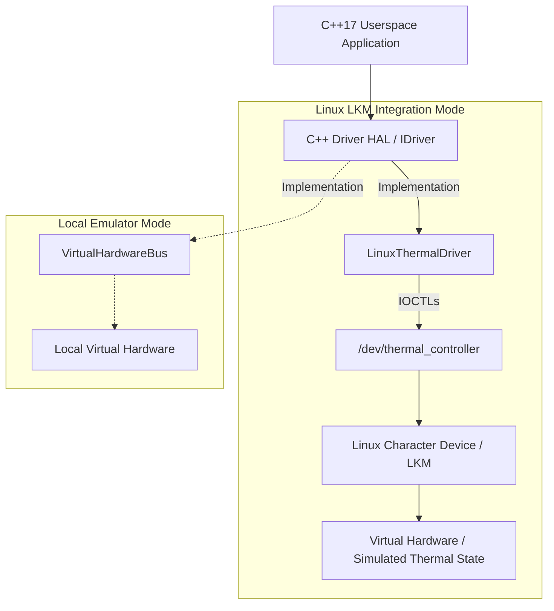
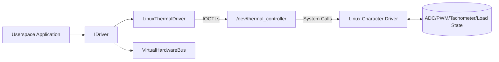
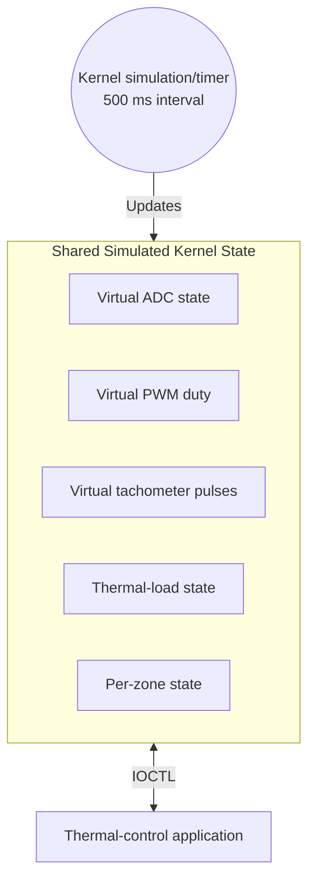
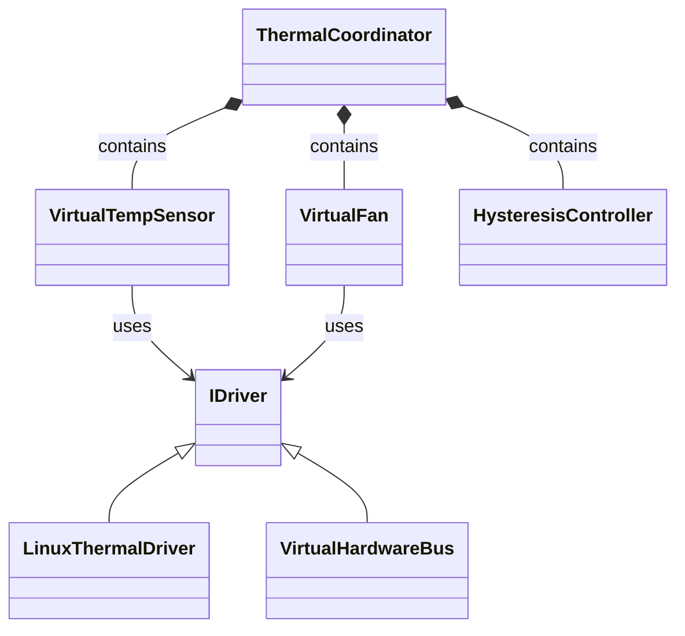
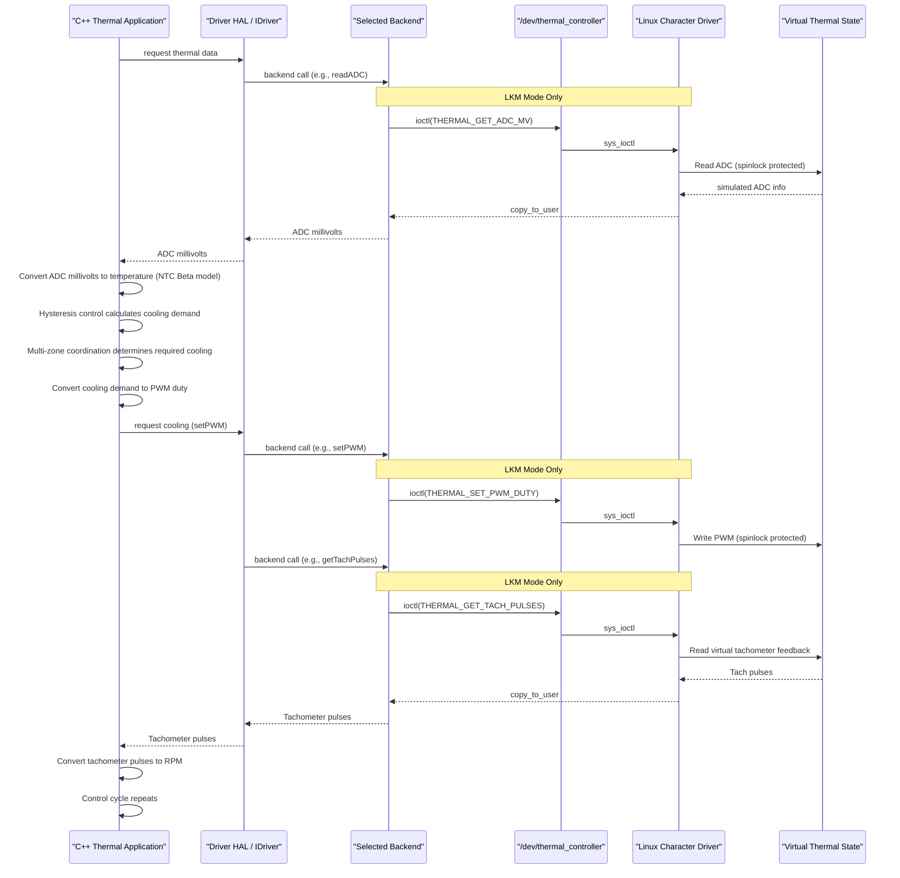
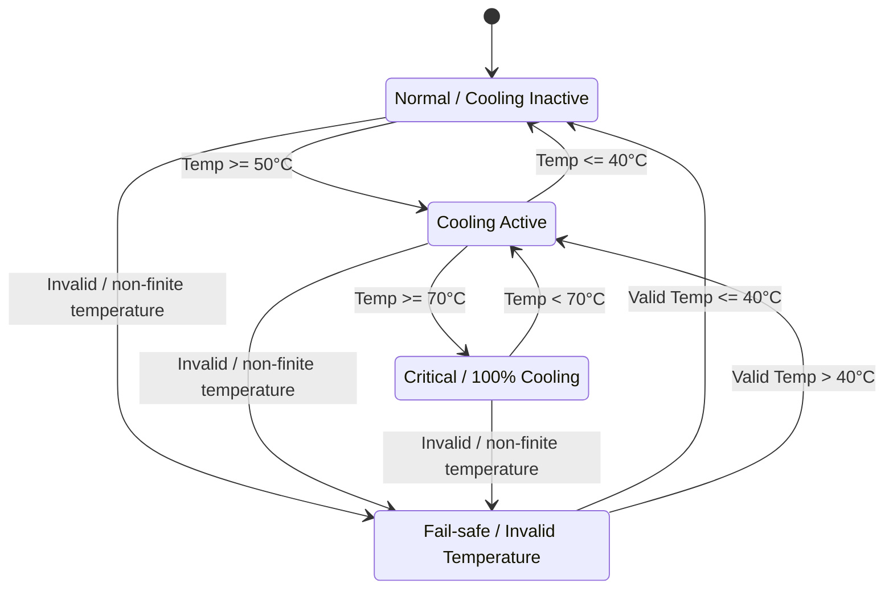
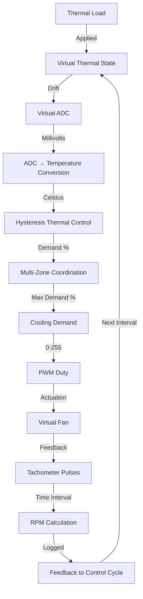

# Stage 3: System Design and Architecture

## Industrial Thermal Management & Dynamic Fan Controller

**Domain:** Domain 5 — Robotics, Edge AI & Hardware Emulation

## 1. Overall System Architecture

The overall system architecture of the Industrial Thermal Management & Dynamic Fan Controller involves a decoupled, software-only environment designed to simulate and manage multi-zone thermal dynamics. It supports two primary execution paths: a Linux Loadable Kernel Module (LKM) integration mode where the C++17 userspace application communicates through a Hardware Abstraction Layer (HAL) to a custom Linux character device (`/dev/thermal_controller`), and a Local Emulator Mode that bypasses the kernel for rapid logic validation. Both paths interact with a virtual hardware model rather than physical sensors or fans.

## 2. Components and Responsibilities

| Component | Responsibility |
|---|---|
| Linux character driver / LKM | Registers the character device and handles the required driver operations, and runs the kernel timer for simulation. |
| `thermal_controller.c` | Contains the implementation for the Linux kernel module, including file operations and simulated hardware logic. |
| `thermal_controller_ioctl.h` | Defines the IOCTL command macros (`THERMAL_*`) and shared data structures between kernel and userspace. |
| `IDriver` | Abstract C++ interface defining the hardware abstraction layer (HAL) methods for accessing ADC, PWM, and tachometer registers. |
| `LinuxThermalDriver` | Concrete C++ implementation of `IDriver` that communicates with `/dev/thermal_controller` via Linux IOCTLs. |
| `VirtualHardwareBus` | Concrete C++ implementation of `IDriver` serving as a local emulator backend without kernel dependency. |
| Virtual temperature/ADC | Simulates NTC thermistor millivolt output based on the applied thermal load and cooling effects. |
| Virtual fan/PWM | Simulates an 8-bit PWM-controlled cooling fan. |
| Virtual tachometer | Simulates tachometer pulse accumulation proportional to the current fan RPM. |
| Thermal-load simulation | Injects artificial heating requirements dynamically into the simulation engine. |
| NTC temperature conversion | Translates simulated ADC millivolts to realistic Celsius temperatures using the NTC Beta-parameter temperature conversion. |
| Hysteresis controller | Calculates cooling demand percentage based on configurable high, low, and critical temperature thresholds. |
| Thermal coordinator | Monitors multiple zones to determine the maximum required cooling speed across all active zones. |
| C++ thermal-control engine | Orchestrates the periodic execution of the control loop, scenario injection, and runtime state reporting. |

## 3. Component and Interface Relationships

The system relies on cleanly abstracted interfaces to separate high-level thermal logic from low-level backend implementations. `IDriver` is the abstraction that allows the thermal-control logic to work with both the Linux driver backend and the local emulator backend.

- **Userspace application ↔ `IDriver`**: The application uses the `IDriver` interface exclusively, ensuring it remains backend-agnostic.
- **`IDriver` ↔ `LinuxThermalDriver`**: `LinuxThermalDriver` implements `IDriver` for LKM mode.
- **`IDriver` ↔ `VirtualHardwareBus`**: `VirtualHardwareBus` implements `IDriver` for local emulator mode.
- **`LinuxThermalDriver` ↔ `/dev/thermal_controller`**: Communication between the userspace driver backend and the kernel module occurs via standard Linux VFS file operations.
- **Userspace ↔ kernel through `THERMAL_*` IOCTLs**: Device-specific thermal-controller operations (ADC read, PWM set, Tachometer clear) are mapped to distinct IOCTL command codes.
- **Kernel simulated state ↔ ADC/PWM/tachometer/load state**: The LKM reads and modifies internal static arrays representing the simulated state, securely protected by a spinlock.

## 4. Virtual Hardware / Register Model

Instead of physical hardware components, this project models hardware-oriented state purely in software. A kernel timer automatically triggers every 500 ms to update the shared simulation state, reflecting the heating effects of the applied thermal load and the cooling effects of the current PWM duty cycle. 

Shared simulated kernel state arrays are safely accessed and modified under the protection of a driver spinlock to prevent race conditions between the asynchronous timer and userspace IOCTL system calls. These are simulated software states, not physical hardware registers.

## 5. Important Data Structures

| Data Structure / Type | Purpose |
|---|---|
| Driver thermal/simulation state | Holds internal kernel simulation arrays for ADC millivolts, PWM duty cycles, tachometer pulses, and dynamic zone loads. |
| IOCTL state structure | C-struct shared between kernel and userspace for transferring legacy state information. |
| `IDriver` interface | C++ pure virtual class defining methods for virtual hardware interaction. |
| Driver backend state | Internal class variables within `LinuxThermalDriver` maintaining the file descriptor for `/dev/thermal_controller`. |

## 6. UML Class / Component Relationships

## 7. Runtime Sequence — One Thermal Control Cycle

## 8. Thermal Control State Machine

## 9. End-to-End Thermal Workflow

This flowchart represents a software simulation workflow:

## 10. Design Decisions and Constraints

- Linux character device is used for userspace/kernel communication.
- IOCTL provides device-specific control operations.
- C++ Driver HAL separates thermal-control logic from the driver backend.
- `LinuxThermalDriver` supports Linux LKM integration.
- `VirtualHardwareBus` supports local emulator execution.
- Spinlock protects shared simulated kernel state.
- Kernel timer updates simulated state every 500 ms.
- Software-only architecture removes dependency on physical thermal hardware.
- Physical hardware integration remains future scope.

## 11. Roadmap for Stage 4

Stage 4 should focus on:
- Linux character-device driver implementation
- Driver initialization
- Device registration
- `open`
- `read`
- `write`
- `ioctl`
- `release`
- IOCTL data structures
- `copy_to_user`
- `copy_from_user`
- Kernel timer
- Spinlock synchronization
- Error handling
- Driver cleanup/unload
