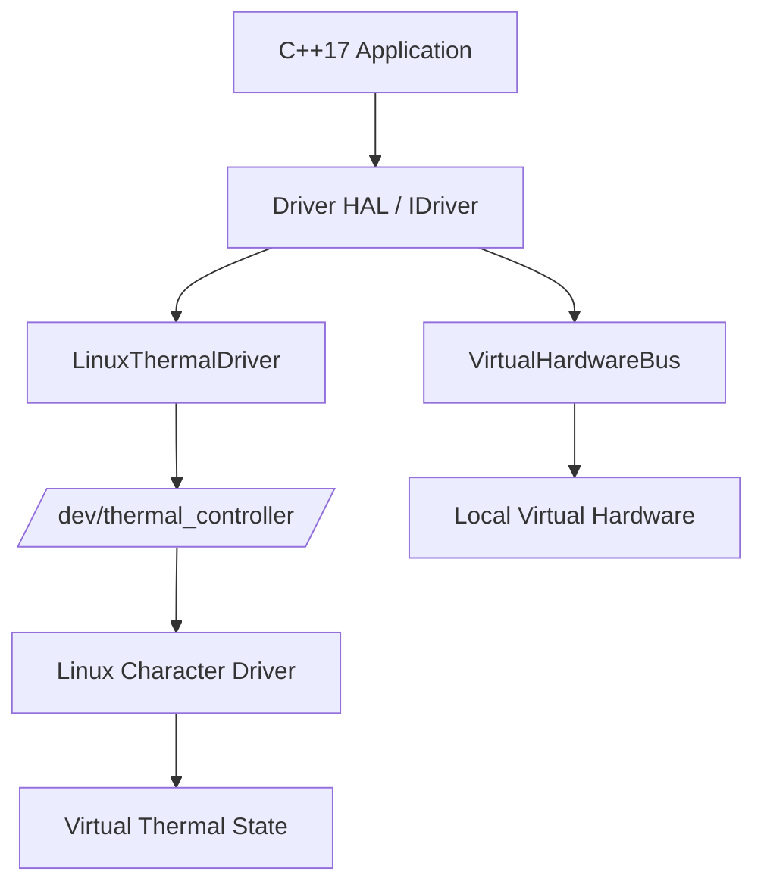

# Stage 4 — Implementation and Integration

## Industrial Thermal Management & Dynamic Fan Controller

**Domain:** Domain 5 — Robotics, Edge AI & Hardware Emulation

## 1. Linux Character Driver Implementation

The actual Linux character-device implementation consists of a Linux Loadable Kernel Module.

- Character-device registration creates `/dev/thermal_controller`.
- Driver initialization sets up the character device, virtual hardware timers, and memory structures.
- Driver cleanup safely destroys resources.
- `open()`: Handles device open.
- `read()`: Formats the legacy thermal state and copies it to userspace.
- `write()`: Handles a bounded user buffer.
- `ioctl()`: Provides structured thermal state, ADC, PWM, tachometer, and simulated-load operations.
- `release()`: Handles device close.

## 2. IOCTL Interface

The driver supports eight actual IOCTL commands:

| Command | Purpose |
|---|---|
| `THERMAL_GET_STATE` | Read thermal state |
| `THERMAL_SET_TARGET_TEMP` | Write target temperature |
| `THERMAL_SET_FAN_SPEED` | Write legacy fan speed |
| `THERMAL_RESET` | Reset simulated/legacy state |
| `THERMAL_GET_ADC_MV` | Read channel ADC millivolts |
| `THERMAL_SET_PWM_DUTY` | Write channel PWM duty |
| `THERMAL_GET_TACH_PULSES` | Read and clear channel tachometer pulses |
| `THERMAL_SET_SIM_LOAD` | Write channel simulated load |

The actual IOCTL forms used include:
- `_IOR`
- `_IOW`
- `_IO`
- `_IOWR`

## 3. User/Kernel Data Transfer

Data transfer between user space and kernel space uses:
- `copy_from_user()`
- `copy_to_user()`

The verified GET_STATE safety pattern is implemented as follows:
1. Shared thermal state is copied into a local kernel structure while the spinlock is held.
2. The spinlock is released.
3. `copy_to_user()` is performed after releasing the lock.

## 4. Synchronization

The actual synchronization mechanism uses:
- `spin_lock_irqsave()`
- `spin_unlock_irqrestore()`

The shared simulated thermal state is protected during timer-driven updates and IOCTL state access.

## 5. Kernel Timer and Virtual Hardware

The virtual hardware is simulated using a 500 ms kernel timer.

It simulates:
- simulated ADC millivolts
- simulated PWM duty
- simulated tachometer pulses
- simulated thermal load

The timer callback changes the simulated thermal state according to the simulated load and PWM cooling, and accumulates tachometer pulses. These are software-simulated hardware-oriented values, not physical hardware registers.

## 6. Error Handling and Cleanup

Verified error handling:

| Condition | Response |
|---|---|
| Invalid channel | `-EINVAL` |
| `copy_to_user()` / `copy_from_user()` failure | `-EFAULT` |
| Unsupported IOCTL | `-ENOTTY` |
| Linux driver open failure | `runtime_error` |

Actual cleanup order:
- `del_timer_sync()`
- `cdev_del()`
- `device_destroy()`
- `class_destroy()`
- `unregister_chrdev_region()`

Timer synchronization occurs before driver resources are destroyed.

## 7. C++ Driver HAL and Integration

Userspace integration utilizes a Hardware Abstraction Layer (HAL):
- `IDriver`
- `LinuxThermalDriver`
- `VirtualHardwareBus`

The HAL separates thermal-control logic from the selected driver backend.

**Linux LKM mode:**
C++ application → HAL → `LinuxThermalDriver` → `/dev/thermal_controller`

**Local emulator mode:**
C++ application → HAL → `VirtualHardwareBus`

## 8. Thermal-Control Implementation

The actual implemented logic includes:
- NTC Beta-parameter temperature conversion
- hysteresis control
- multi-zone coordination
- PWM duty calculation
- tachometer/RPM calculation
- invalid/non-finite temperature fail-safe
- virtual temperature/load/fan behavior

The documented thresholds are:
- Low: 40°C
- High: 50°C
- Critical: 70°C

## 9. Integration Verification

The verified integration modes are:
- Local Emulator Mode
- Linux LKM Integration Mode

A 60-second LKM scenario was verified.

## 10. Implementation Flow Diagram

## 11. Roadmap for Stage 5

Stage 5 will document:
- build verification
- driver/device verification
- IOCTL regression testing
- virtual hardware verification
- thermal-control verification
- multi-zone verification
- 60-second LKM integration test
- limitations of the available test evidence
